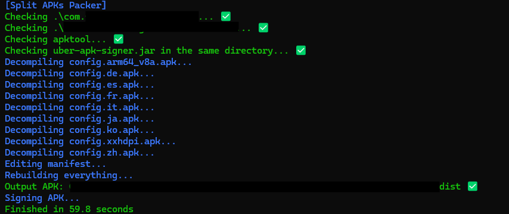

# SplitAPK Packer (SAP)

This Python script is designed to combine split APKs into a single, unified APK file

## 🚀 Features
- **Simple:** Easily pack split APKs and your modified base APK into one file.
- **Efficiency:** Automates the tedious process of combining split APKs.
- **Supported Formats:** Works seamlessly with `.xapk` files, which can easily be unpacked for use.

## 📦 Requirements
To get started, you'll need the following tools:
- [**apktool**](https://github.com/iBotPeaches/Apktool) - for decompiling and recompiling APKs.
- [**uber-apk-signer**](https://github.com/patrickfav/uber-apk-signer) - included in the same directory as the script for signing the final APK.

## 📜 Usage (with .xapk)
1. **Prepare Your APK:**
   - If you have an app bundle or a `.xapk` file (which is essentially a zip file), simply rename the file with a `.zip` extension and unzip its contents. Inside, you should find your `base.apk`, some `arch.apk`, and additional APKs.

2. **Decompile the Base APK:**
   - Move the `base.apk` outside the extracted folder and run the following command to decompile it:
     ```bash
     apktool d base.apk
     ```

3. **Make Modifications (Optional):**
   - This is where you can make any changes to your app's resources or code as required if you have the permissions.

4. **Pack the Split APKs:**
   - Once your modifications are complete, you're ready to combine your split APKs. Run the following command:
     ```bash
     python3 split_apks_packer.py [-h] [-s] [-o OUTPUT] base_apk_dir split_apks_folder
     ```
   - Replace `base_apk_dir` with the path to your modified base APK directory and `split_apks_folder` with the folder containing the other split APKs.


## Sample output


## 🔧 Command-Line Options
- `-h` : Show help message and exit.
- `-s` : Sign the final APK.
- `-o OUTPUT` : Output path where the build files will be stored.

## 🌟 Contributing
Feel free to open issues, suggest improvements, or submit pull requests.
